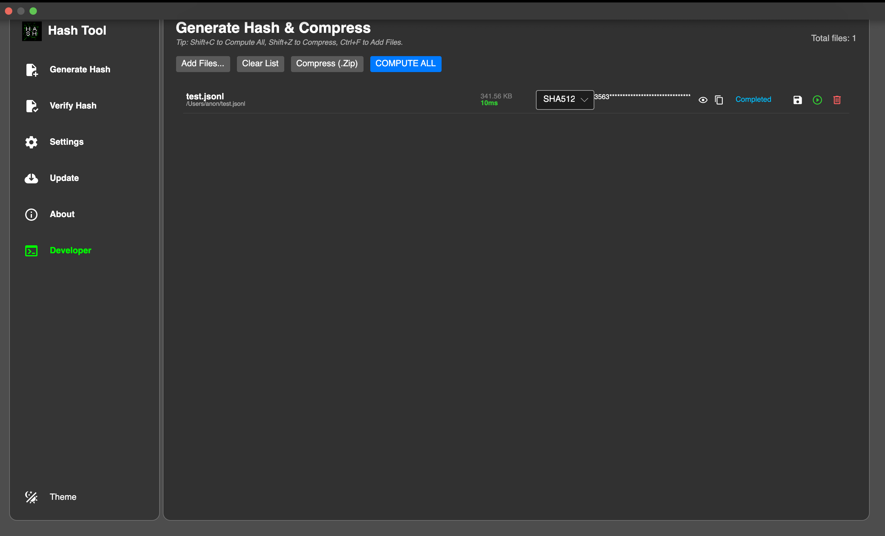
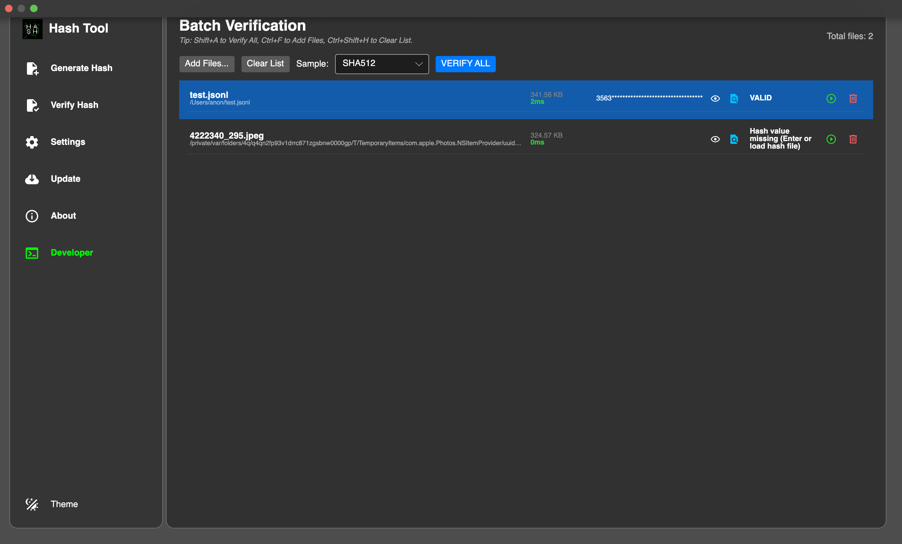
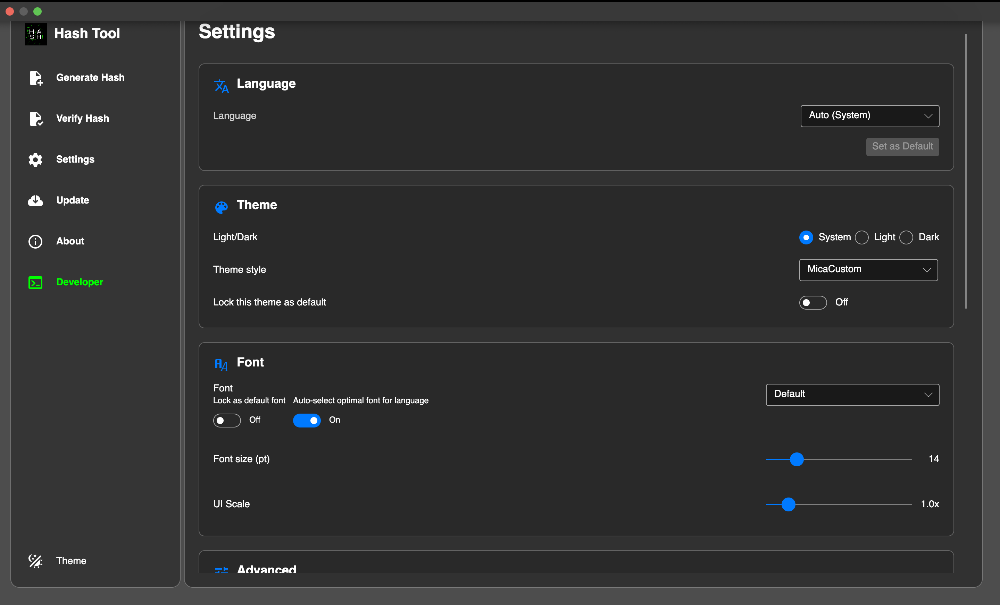
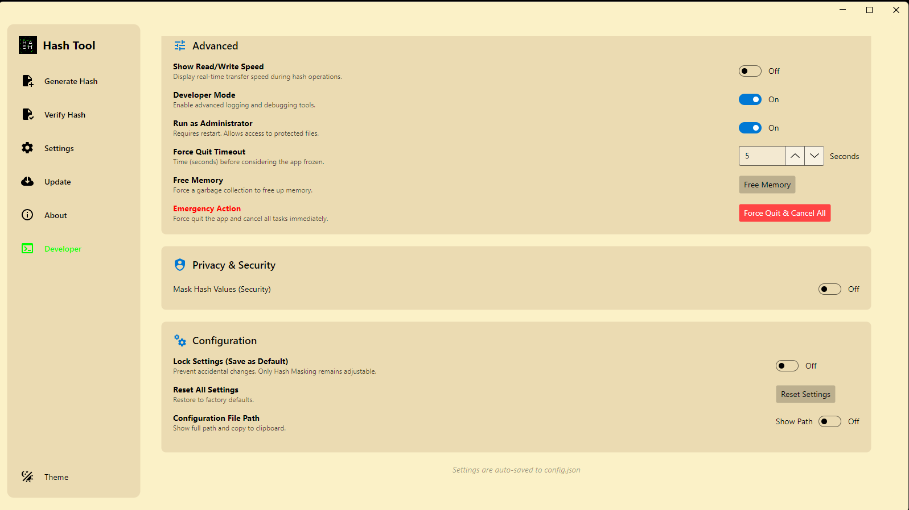
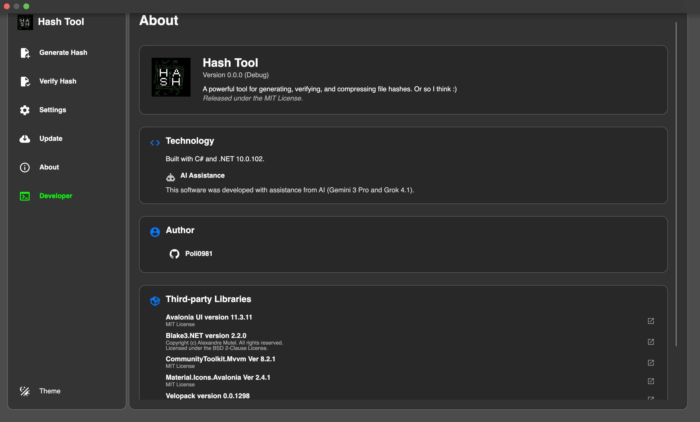
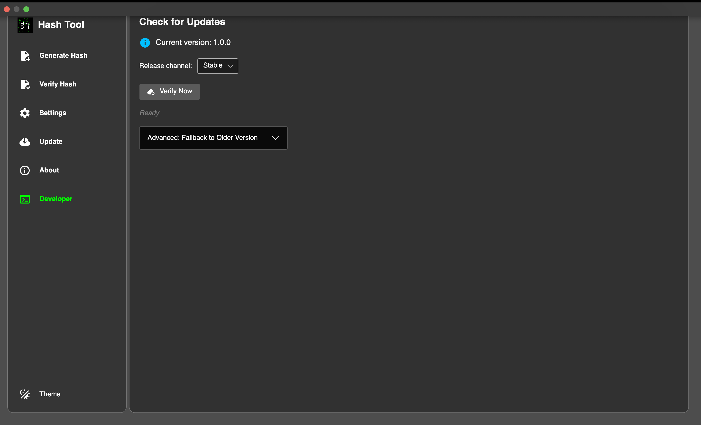
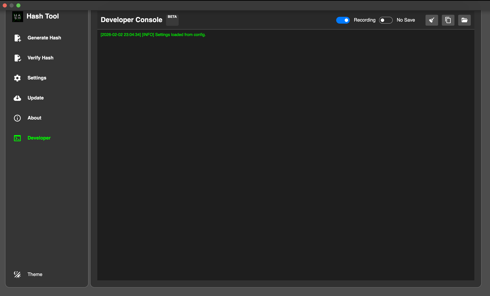
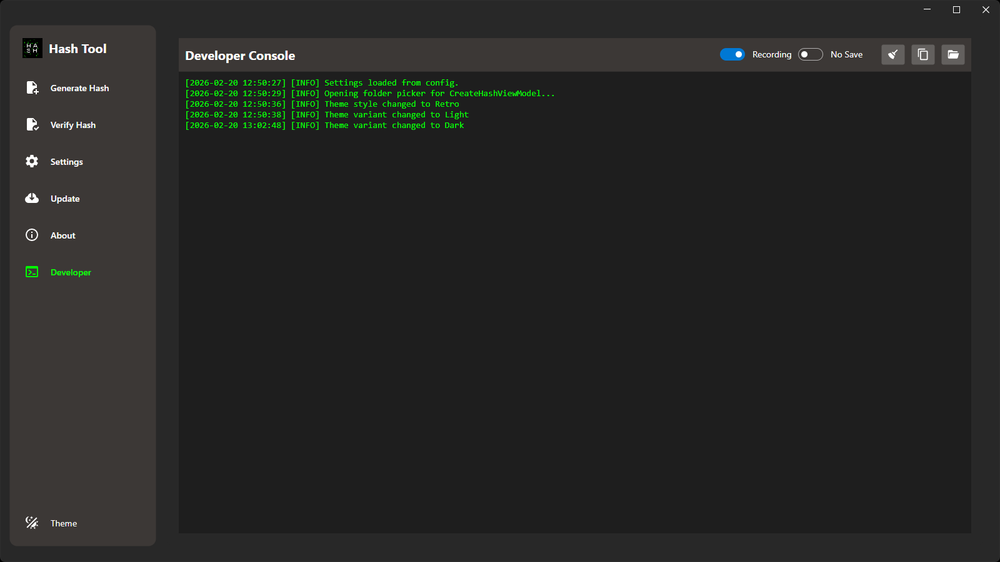

# HashTool 🛠️

  

**A user-friendly, cross-platform desktop app (Windows & macOS) for generating, verifying, and managing file hashes — no terminal commands required.**

Built with C# on .NET 10 and Avalonia UI.

## Motivation

Why open a terminal and type cryptic commands just to hash a file?  
HashTool was born out of pure laziness — a simple, intuitive GUI to do the job without the hassle.

## Screenshots

  
*Generate Hash – batch processing with multiple export options*

  
*Verify Hash – smart detection and batch verification*

  
*Settings – themes, localization, performance tweaks*

  
*Settings – Windows Admin Mode, Hash Masking, Developer Mode, etc.*

 
*About – version info and links*

  
*Update – check for latest version*

  
*Developer Mode – extra tools for power users*

 
*Dark Mode – because who doesn't love dark mode?*

## Features

### Generate Hash

-   **Batch processing**: Compute hashes for multiple files simultaneously using parallel processing.
-   **Export options**:
    -   Save individual hash files (e.g., `filename.ext.sha256`).
    -   Copy hash results to clipboard.
    -   Bundle all hashes into a single ZIP archive.

### Verify Hash

-   **Batch verification**: Check multiple files against their expected hashes.
-   **Smart detection**:
    -   Automatically finds accompanying hash files (e.g., checks `image.png.sha256` when verifying `image.png`).
    -   Directly load hash files (`.md5`, `.sha1`, etc.) to verify the source file.

### Settings & Customization

-   **Appearance**:
    -   Light, Dark, or System theme.
    -   Custom UI scaling and font size.
-   **Localization**: 30+ languages with auto-detection based on OS. Manually override and set as default.
-   **Performance**: Configure max file size limits and per-file timeout.
-   **Windows Admin Mode**: Toggle elevated privileges when needed.
-   **Extra goodies**: Hash masking (hide sensitive parts), Developer Mode, Settings Lock, UI Reset.

> **Note**: Hashing speed depends on your drive (SSD vs HDD) and system load.

### Update

-   **Update**: Check for updates on "Update" page.

### Supported Algorithms

-   MD5
-   SHA1
-   SHA256
-   SHA384
-   SHA512
-   BLAKE3
-   CRC32
-   XXHash64
-   XXHash128
-   XXHash32
-   XXHash3

## Installation

### Windows

-   **Installer**: Download `HashTool-win-setup.exe` from GitHub Releases → run → done in seconds.
-   **Portable**: Download the ZIP → extract → run `Hash Tool.exe`.

### macOS

*(May trigger Gatekeeper warnings — unsigned app because no Apple Developer account yet 😅)*

-   **Installer**: Download `.pkg` → Continue → Install → Done.
-   **Portable**: Download `.zip` → extract → open `.app` (right-click → Open if Gatekeeper complains).

## Usage

The UI is designed to be dead simple — drag & drop files, pick your algorithm, hit Go.  
Detailed guides and advanced tips will be added to the [Wiki](https://github.com/poli0981/HashTool/wiki) soon.

## Contributing

Want to help? Check out [CONTRIBUTING.md](CONTRIBUTING.md) for bug reports, feature requests, or code contributions.

## Legal Stuff

-   [LICENSE (MIT)](LICENSE)
-   [EULA](docs/EULA.md)
-   [Disclaimer](/docs/DISCLAIMER.md)
-   [Terms of Service](/docs/ToS.md)
-   [Privacy Policy](/docs/PrivacyPolicy.md)
-   [Security Policy](SECURITY.md)
-   [Code of Conduct](CODE_OF_CONDUCT.md)

## Acknowledgements

Big thanks to the open-source community and AI assistants — full credits in [ACKNOWLEDGEMENTS.md](ACKNOWLEDGEMENTS.md).

---

Made with ❤️ (and a lot of coffee) by poli0981

*© 2026 poli0981. All rights reserved.*